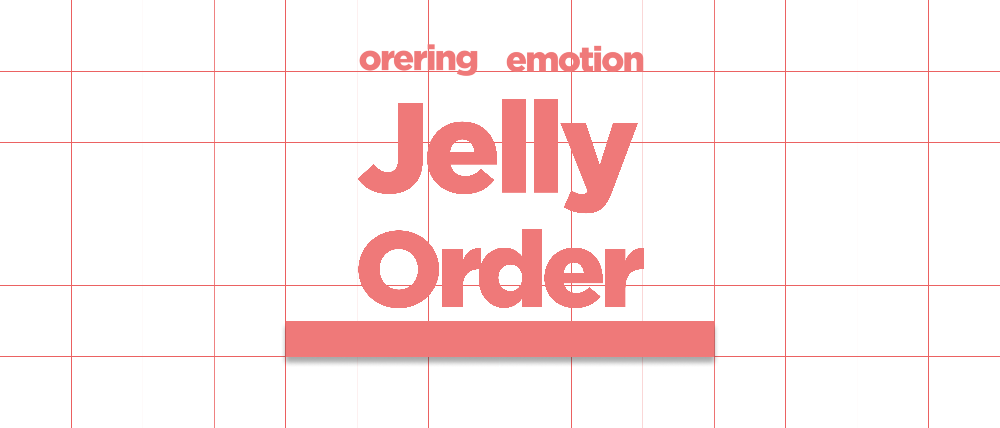

# Jelly Order 🍧

###  혜성충돌
> **먼지와 암석, 얼음이 모여 혜성이 되었고, 우리는 세상을 향해 전속력으로 충돌합니다.**

<table>
  <tr>
    <td align="center">
       
      <b><a href="https://github.com/JeaPple" target="_blank" rel="noreferrer">김형진</a></b>
    </td>
    <td align="center">
       
      <b><a href="https://github.com/ifunhy" target="_blank" rel="noreferrer">김현지</a></b>
    </td>
    <td align="center">
       
      <b><a href="https://github.com/jinnn12" target="_blank" rel="noreferrer">김진호</a></b>
    </td>
    <td align="center">
       
      <b><a href="https://github.com/solidify-d" target="_blank" rel="noreferrer">박혜성</a></b>
    </td>
  </tr>
</table>

---
## 0. 프로젝트 소개

  

      Jelly Order는 소상공인의 비용 부담과 디지털 격차 문제를 해결하기 위해,
  

  
  

      누구나 쉽게 도입·운영할 수 있는 오픈소스 경량 테이블 오더·POS 시스템입니다.
  

---
## 1. 프로젝트 기획서

프로젝트 개요

Jelly Order는 소상공인을 위한 경량형 오픈소스 테이블 오더·경량 POS 시스템이다. 상용 솔루션의 초기 설치비·월 구독료·PG 수수료 등 비용 장벽과, 고령층·IT 비숙련자에게 어려운 복잡한 UI를 핵심 문제로 규정하고, 직관적·대형 폰트 기반 UI/UX와 수수료 락인 없는 아키텍처(VAN/현금/기본 카드 단말 연동 중심)를 제공한다. 이를 통해 점주는 더 단순한 POS 운영 경험, 고객은 쉽고 빠른 주문 경험을 얻으며, 누구나 코드와 문서를 내려받아 무상으로 자체 설치·개조할 수 있도록 오픈소스로 배포한다. 비용 부담과 디지털 격차가 실제 현장에서 도입 저해 요인으로 보고되고 있음을 전제로 설계하였다.

---

프로젝트 배경

  

### 1) 비용 장벽과 수수료 구조의 불투명성
테이블오더 확산은 인건비 절감을 배경으로 빠르게 진행되었으나, **PG 연동에 따른 높은 결제 수수료(대개 0.8~2.5% 이상)**, **월 구독료·통신비·장비비** 등으로 기대 절감액보다 **고정지출이 커지는 사례**가 다수 보도되었다. 일부 사업장은 **의무사용·위약금** 등 계약 리스크도 경험한다. 업계·언론 보도는 **VAN 위주 결제 대비 PG 경유 시 월 수십만 원~연 수백만 원 추가 비용**이 발생할 수 있음을 지적한다. 또한 법·제도상 **PG 수수료에 대한 제한이나 표준화가 미흡**하다는 점도 반복적으로 제기되고 있다. [YTN](https://www.ytn.co.kr/_ln/0102_202410181024214328)[서울경제](https://www.sedaily.com/NewsView/2DFEDQEVRN)[네이트 뉴스](https://news.nate.com/view/20240108n02405)

> 예시: 월매출 2,000만 원 업장에서 PG 3.3% + 서비스 0.6% ≈ 3.9%로 월 78만 원 수준의 수수료가 발생했다는 보도 사례가 확인된다. 정부 지원으로 설치했더라도 운영 수수료 부담은 영세사업자 몫이라는 점도 지적되었다. 네이트 뉴스

정부·유관기관도 최근에는 **결제기기 수수료 안내 및 계약 전 유의사항**을 배포하며 자율 예방을 독려하고 있으나, **도입 이후의 비용 구조 최적화**는 여전히 점주에게 과도하게 전가되는 양상이다. [소상공인24](https://www.sbiz.or.kr/smst/bbs/view.do?bbsSn=6840&key=211130603916)

---

### 2) 고령층·IT 비숙련자 사용성 문제
고령층은 **작은 글씨·복잡한 화면 흐름·결제 오류 대응 난이도**로 인해 디지털 주문 채널 이용을 **포기하거나 직원 의존**이 잦다는 탐방·설문 결과가 다수 보고된다. 서울시 조사 등에서도 **기기 이용률 저조·심리적 부담**이 확인되며, **교육·큰 글씨·음성안내** 등 보조 설계 시 **적응이 빠르게 개선**된 사례가 보고되었다. 이는 UI의 직관성·접근성(가독성, 단계 축소, 용어 단순화)이 도입 성패를 좌우함을 시사한다. [브라보마이라이프](https://bravo.etoday.co.kr/view/atc_view/13547)

---

### 3) 디지털 전환의 필요와 현실 간 간극
학술·정책·언론 자료는 무인주문·스마트오더·키오스크 등 **스마트 기술이 소상공인 운영 효율에 기여**함을 인정하는 동시에, **도입·운영 비용과 투자 부담**, **연령대별 디지털 격차**가 보급의 병목임을 제시한다. Jelly Order는 **오픈소스 배포·저비용 도입·고령친화 UI**로 이 간극을 해소하고자 한다. [KCI](https://www.kci.go.kr/kciportal/ci/sereArticleSearch/ciSereArtiView.kci?sereArticleSearchBean.artiId=ART002995983)

---

목표 및 목적

### 1) 최상위 목적(미션)
- **비용 장벽 제거:** 오픈소스로 공개하여 **초기비용·구독료 부담 없이** 자체 호스팅·로컬 설치를 가능하게 한다. **PG 락인 회피**와 **VAN/기존 카드단말·현금결제 연동**을 우선시해 수수료 부담을 최소화한다. [소상공인24](https://www.sbiz.or.kr/smst/bbs/view.do?bbsSn=6840&key=211130603916)
- **디지털 격차 완화:** 대형 폰트·높은 대비·명료한 한국어 용어·단계 최소화 설계를 통해 **고령층·IT 비숙련자**도 스스로 주문·결제가 가능하도록 한다. [브라보마이라이프](https://bravo.etoday.co.kr/view/atc_view/13547)

---

### 2) 이해관계자별 목표
- **점주(매장) 관점**
  - 설치·학습·운영이 **쉬운 경량 POS 콘솔** 제공(메뉴·재고·품절·좌석/테이블 관리 최소 클릭 흐름).
- **고객(사용자) 관점**
  - 노령친화 모드(글자 크게/버튼 크게/음성 힌트/오류 복구 유도)로 주문 포기율 감소.
  - **5클릭 이하 주문**(카테고리→메뉴→옵션→수량→결제)으로 인지부하 최소화. [브라보마이라이프](https://bravo.etoday.co.kr/view/atc_view/13547)

---

### 3) 정량 KPI(초기 제안)
- **도입비 절감**: 상용 대비 **초기 CAPEX 80% 이상 절감**(오픈소스·상용 태블릿 활용 전제, 장비비만 부담). 근거: 상용은 **월 구독료+PG 수수료**로 누적 비용이 커지는 구조가 다수 보고. [YTN](https://www.ytn.co.kr/_ln/0102_202410181024214328)[서울경제](https://www.sedaily.com/NewsView/2DFEDQEVRN)
- **수수료 최적화**: **VAN/직접 정산** 우선 구성 시 **PG 추가 수수료 0~최소화**를 목표(매장 계약 환경에 따라 변동). [서울경제](https://www.sedaily.com/NewsView/2DFEDQEVRN)
- **주문 성공률**: **노령친화 UI** 도입 매장 기준 **주문 포기율(결제 전 이탈) 30%↓** 목표. 관련 탐방·조사에서 고령층의 사용 포기 및 심리적 부담이 높은 것으로 확인. [브라보마이라이프](https://bravo.etoday.co.kr/view/atc_view/13547)
- **학습 곡선**: 점주 대상 **초기 온보딩 30분 내 기본 운영 가능**(메뉴 등록·품절 처리·영수증 확인).

---

### 4) 핵심 기능 범위(요약)
- **점주 콘솔**: 메뉴/옵션/가격, 테이블·좌석, 재고/품절(재료 연동), 주문 현황, 정산 리포트(수수료 시뮬레이터 포함).
- **고객 UI**: **대형 폰트·단순 레이아웃**, 고대비 테마, **오류 복구 안내**, 결제 유도 최소 단계. [브라보마이라이프](https://bravo.etoday.co.kr/view/atc_view/13547)
- **결제 연동**: **VAN/기존 카드단말·현금 결제** 기본, 필요 시 **PG 연동 선택적 제공**(수수료 경고/비교 안내). [서울경제](https://www.sedaily.com/NewsView/2DFEDQEVRN)
- **배포·운영**: 오픈소스 공개, **도커·자체 호스팅 템플릿**, 설치 자동화 스크립트, 운영 가이드/보안 체크리스트.

---

문제정의 요약(자료 근거)

- **수수료·운영비 부담**이 인건비 절감을 상쇄하는 사례 다수, **PG 수수료 상한 부재**·계약 리스크 지적. → 비용 장벽 해소 필요. [YTN](https://www.ytn.co.kr/_ln/0102_202410181024214328) [서울경제](https://www.sedaily.com/NewsView/2DFEDQEVRN) [네이트 뉴스](https://news.nate.com/view/20240108n02405)
- **고령층·비숙련자 사용성 한계**가 도입/이용 저해. **큰 글씨·음성·단계 축소** 지원 시 적응 개선. → 접근성 중심 설계 필요. [브라보마이라이프](https://bravo.etoday.co.kr/view/atc_view/13547)
- 학술·정책 연구는 **스마트 기술의 효용**과 함께 **도입·투자 부담**을 병목으로 지적. → **오픈소스·저비용·자체 설치** 모델의 공공적 가치. [KCI](https://www.kci.go.kr/kciportal/ci/sereArticleSearch/ciSereArtiView.kci?sereArticleSearchBean.artiId=ART002995983)

 

## 2. 기술 스택

### Backend

-000000?style=for-the-badge&logo=fastapi&logoColor=white)

### Frontend

### ☁️ Infra & Cloud

### External API & Integration

### Test & Docs

###  Tools & Collaboration

 

## 3. 분석 및 설계

### 요구사항 명세서 [상세보기](https://docs.google.com/spreadsheets/d/1lV6OYcvnEEBzQFvDyBVyoR1MRkYB52oj-mvlcYLXNRM/edit?gid=1037534638#gid=1037534638)

  
<b>요구사항 명세서</b>

###  화면 설계서 - [상세보기](https://www.figma.com/design/WuBdoUWSz5n3gdSHdMN2qo/be16-4th-team?node-id=0-1&t=5D9WbMwwOTOxQaVj-1)

  
<b>점주 페이지</b>

  
<b>테이블 오더 페이지</b>

### ERD - [상세보기](https://www.erdcloud.com/d/fAJgKBWBde3CPAkgW)

  
<b>ERD</b>

  </img>

### WBS - [상세보기](https://docs.google.com/spreadsheets/d/1lV6OYcvnEEBzQFvDyBVyoR1MRkYB52oj-mvlcYLXNRM/edit?gid=0#gid=0)

  
<b>WBS</b>

### API 명세서 - [상세보기](https://docs.google.com/spreadsheets/d/1lV6OYcvnEEBzQFvDyBVyoR1MRkYB52oj-mvlcYLXNRM/edit?gid=394720298#gid=394720298)

  
<b>API 명세서</b>

 

---

## 4. 사용한 핵심 기술 & 코드
<table>
  <thead>
    <tr>
      <th>사용 기술</th>
      <th>설명</th>
    </tr>
  </thead>
  <tbody>
    <tr>
      <td><b>Redis Pub/Sub 기반 실시간 메시징</b></td>
      <td>
        점주가 식자재 상태를 수정/삭제하거나 고객 태블릿에서 요청사항·주문을 전송하면,
        서비스 계층에서 상태 변화를 즉시 계산하고 <code>Redis Pub/Sub</code> 채널로 이벤트를 발행합니다.  
        이를 통해 다수의 구독자(테이블 단말기·대시보드)에 동시에 전달되며,
        분산 환경에서도 이벤트 유실 없이 안정적으로 실시간 동기화가 이루어집니다.
      </td>
    </tr>
    <tr>
      <td><b>Server-Sent Events(SSE) 기반 상태 동기화</b></td>
      <td>
        백엔드에서 발생한 메뉴/요청 변경 이벤트를 SSE를 통해 단말기로 스트리밍 전송했습니다. 
        Vue 프론트엔드(테블릿 앱·대시보드)는 별도 폴링 없이 항상 최신 상태를 유지할 수 있습니다.
      </td>
    </tr>
    <tr>
      <td><b>WebSocket 기반 실시간 주문 처리</b></td>
      <td>
        <code>STOMP WebSocket</code>을 통해 주문 요청 이벤트를 실시간 전송하고, 
        매장 대시보드는 <code>storeId</code> 기반 topic을, 테이블 단말은 <code>tableId</code> 기반 queue를 구독해 역할을 분리했습니다.  
        Vue 프론트엔드 단말은 해당 채널을 구독하여 주문을 자동 반영하도록 구현해, 
        지연 없이 항상 최신 주문 화면이 갱신됩니다.
      </td>
    </tr>
    <tr>
      <td><b>카카오페이 QR 결제 연동</b></td>
      <td>
        외부 결제 API인 카카오페이를 연동하여 QR 결제를 지원했습니다.  
        <code>결제 준비 → QR 코드 생성/스캔 → 승인 콜백 → 결과 화면 리다이렉트</code>의 플로우를 구성해 안정적인 결제 프로세스를 제공했습니다.
      </td>
    </tr>
  </tbody>
</table>

---

## 5. 단위 테스트 결과서

> 점주 페이지와 테이블 오더 페이지의 핵심 기능을 단위 테스트로 검증했습니다.  
> 각 결과는 접을 수 있는 토글(`details`)로 제공하며, 이미지와 설명을 정렬했습니다.

### 📌 점주 페이지

  
<b>회원가입 및 로그인</b>

  
  - **점주 회원가입**  
    

      
    

  
  - **점주 일반 로그인**  
    

      
    

  
  - **점주 자동 로그인**  
    

      
    

  - **아이디 찾기**  
    

      
    

  - **비밀번호 재설정**  
    

      
    

  
<b>테이블 현황</b>

  - **구역 별 주문 테이블 조회**  
    

      
    

  - **QR 결제 후 테이블 상태 변환**  
    

      
    

  - **카운터 결제**  
    

      
    

  - **테이블 비우기**  
    

      
    

  - **주문 수정**  
    

      
    

  
<b>주문 현황</b>

  - **주문 접수 페이지 (접수 탭)**  
    

      
    

    
  - **주문 접수 페이지 (완료 탭)**  
    

      
    

  - **주문 접수 페이지 (취소 탭)**  
    

      
    

    
  - **실시간 주문 확인**  
    

      
    

  - **조리 완료**  
    

      
    

  - **조리 취소**  
    

      
    

  
<b>메뉴 관리</b>

  - **메뉴 페이지**  
    

      
    

  - **메뉴 생성 (옵션 추가)**  
    

      
    

  - **메뉴 생성 (식자재 설정 및 추가)**  
    

      
    

  - **메뉴 수정 (식자재 소진 시 메뉴 품절)**  
    

      
    

  - **메뉴 삭제**  
    

      
    

  - **메뉴 검색**  
    

      
    

    
  - **카테고리별 메뉴 조회**  
    

      
    

        
  - **카테고리 생성 (중복 불가)**  
    

      
    

  
<b>식자재 관리</b>

  
  - **식자재 관리 페이지**  
    

      
    

  - **식자재 검색**  
    

      
    

    
  - **식자재 추가**  
    

      
    

  - **식자재 수정**  
    

      
    

  - **식자재 삭제**  
    

      
    

  

---

### 📌 테이블 오더

  
<b>주요 기능</b>

  - **대기 화면**  
    

      
    

  - **카테고리 선택**  
    

      
    

    
  - **레이아웃 변경**  
    

      
    

  - **요청사항 전송**  
    

      
    

  - **메뉴 상세 페이지 + 메뉴 담기**  
    

      
    

  - **옵션 타입별 선택**  
    

      
    

    
  - **장바구니 수량 선택**  
    

      
    

    
  - **품절된 메뉴 조회**  
    

      
    

  - **품절된 메뉴 주문**  
    

      
    

    
  - **한정 수량인 메뉴 주문**  
    

      
    

        
  - **정상 주문**  
    

      
    

    
  - **주문 내역 조회**  
    

      
    

  - **QR 결제**  
    

      
      
    

